# Electrohub 
Electrohub is an e-commerce website for online shopping of  electronic products such as laptop, smartphone, camera etc.
It offers high quality gadget, devices and accessories for daily life needs.
Key Technology:
Frontend Technology: HTML,CSS,Javascript 
Backend Technology: PHP  
Database: MySQL  
Framework: Laravel  
Features:
1. Development of an adaptable web application where customer can search their favourite product and order it. 
2. Divided the whole website into two sections: admin and customer. 
3. Different login system for both Customer and Admin using Laravel built in authentication system.
4. Admin can perform CRUD(Create,Read,Update,Delete) operation. 
5. Implementation of backend using MVC (Model,View,Controller) architectural pattern.
6. A stripe payment gateway system.

## 🖼️ Demo Pictures Related to the Project

<h2 align="center">Customer Section</h2>

  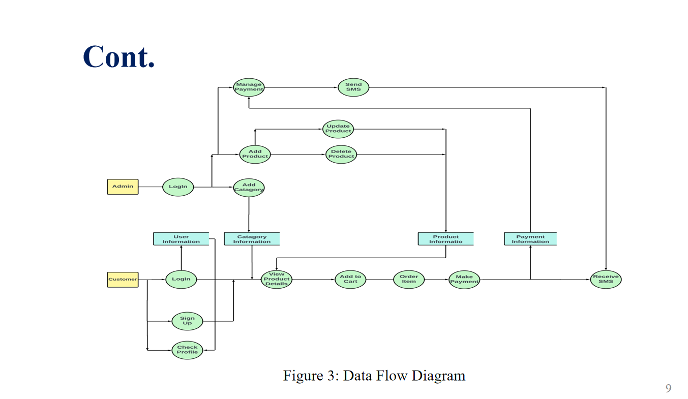

  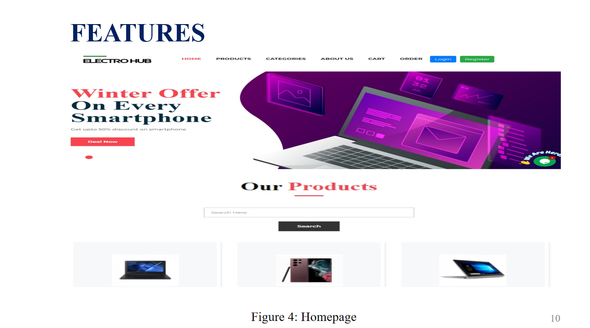

  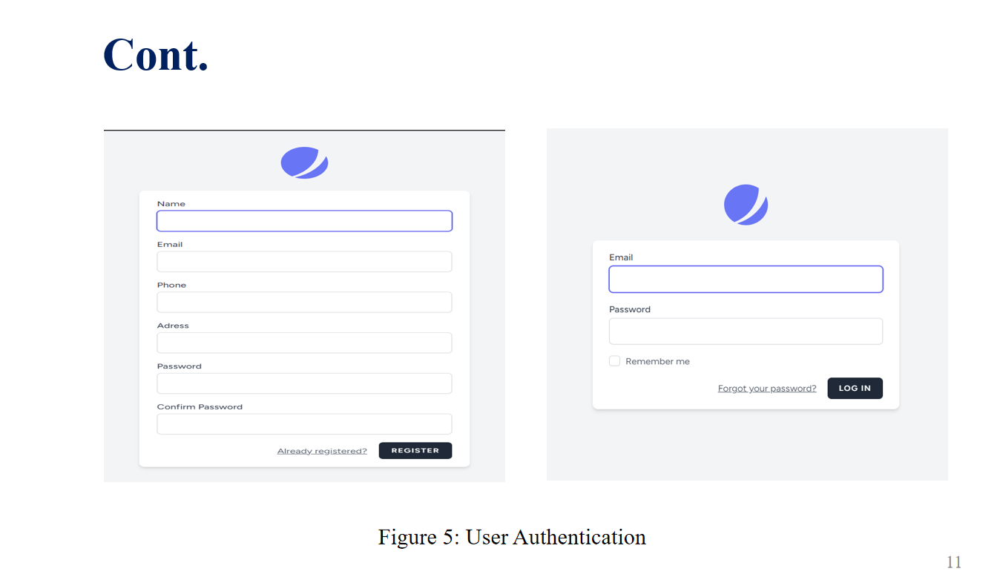

  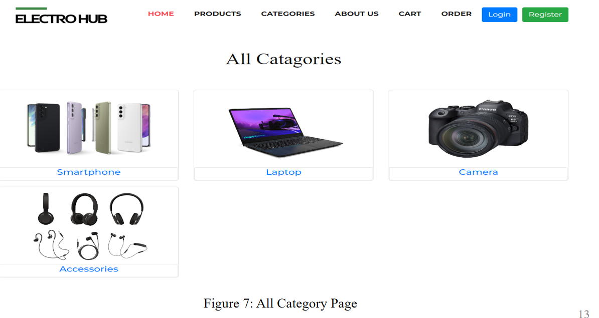

  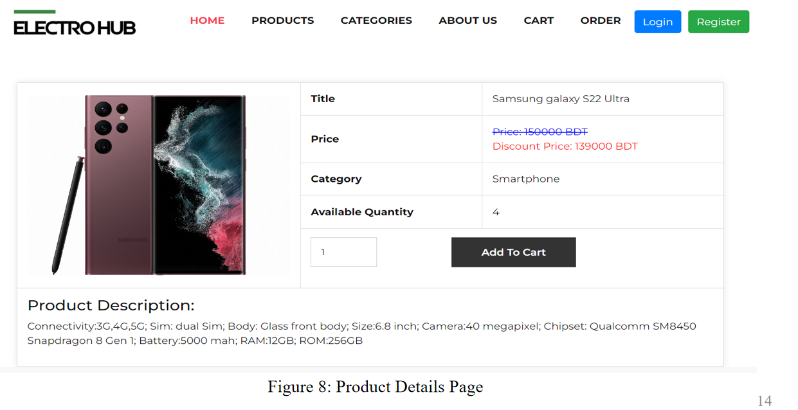

  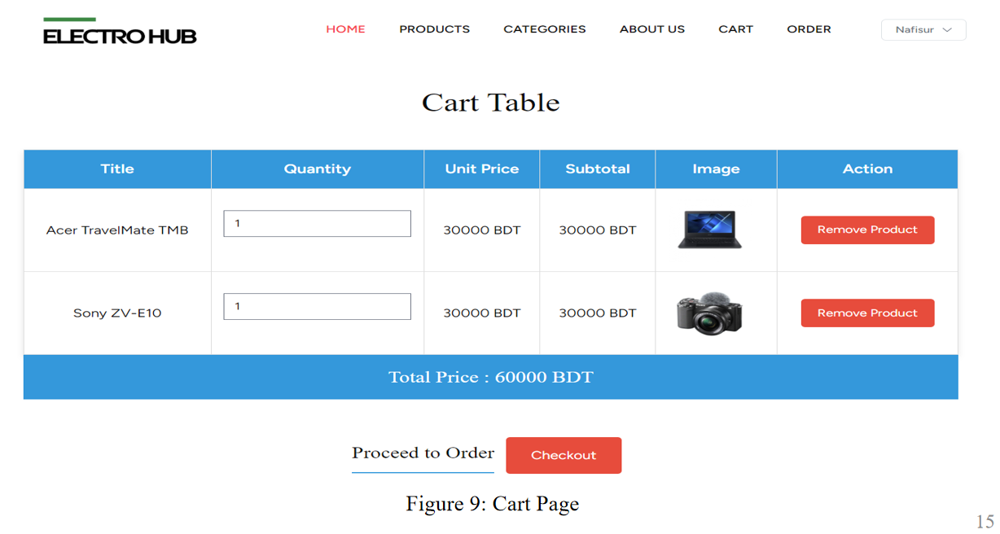

  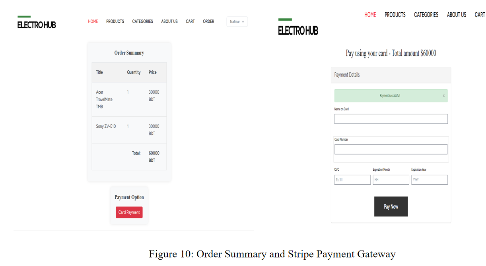

  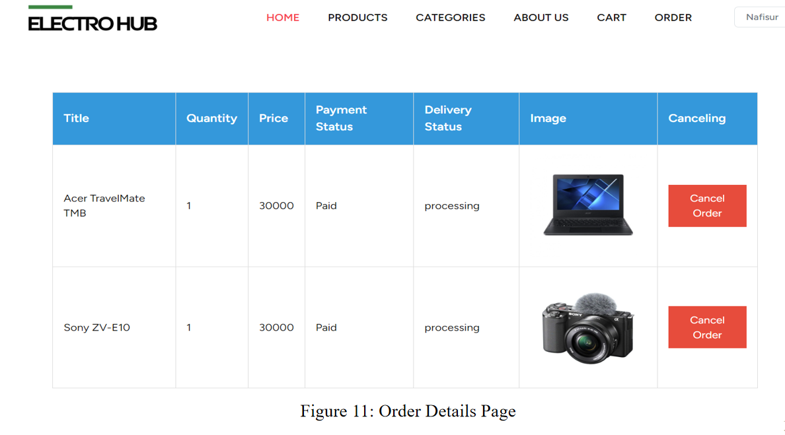

  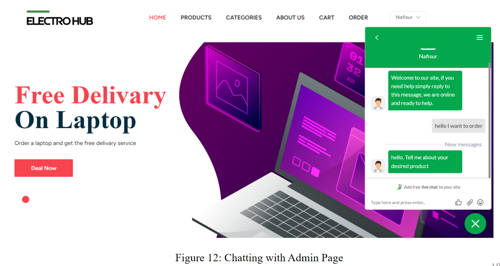

<h2 align="center">Admin Section</h2>

  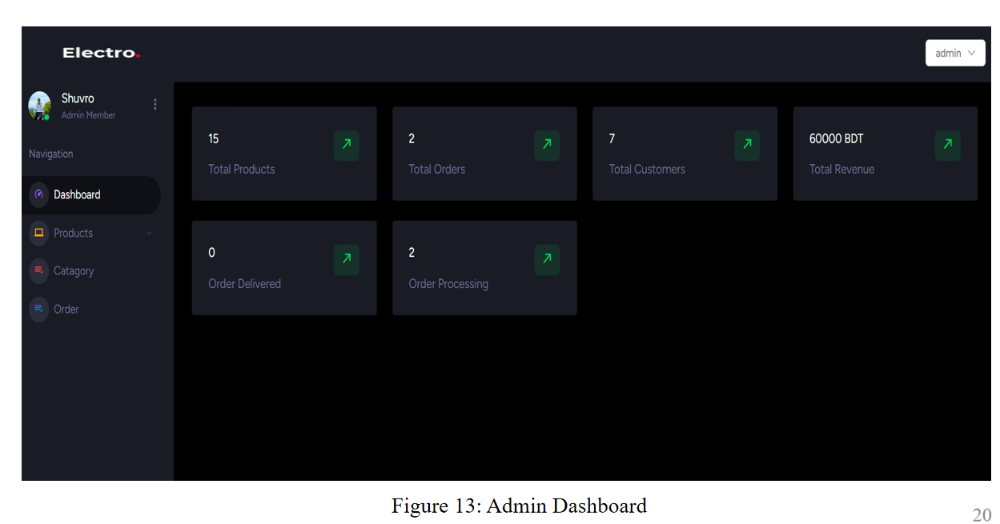

  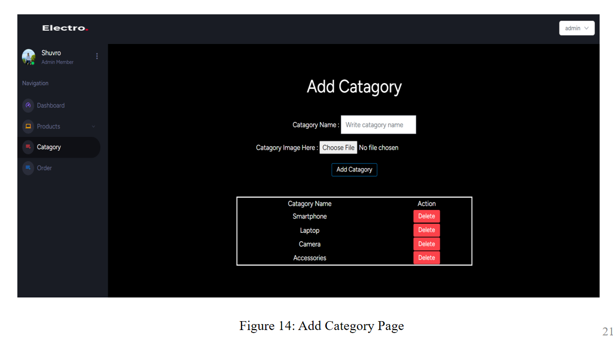

  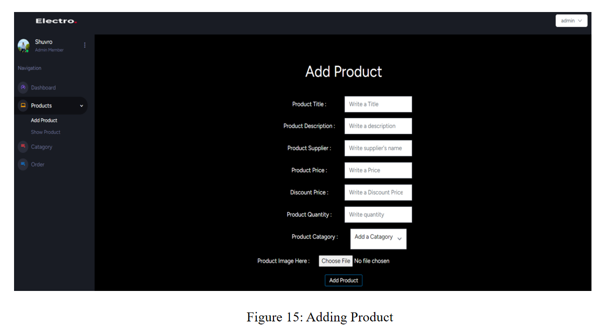

  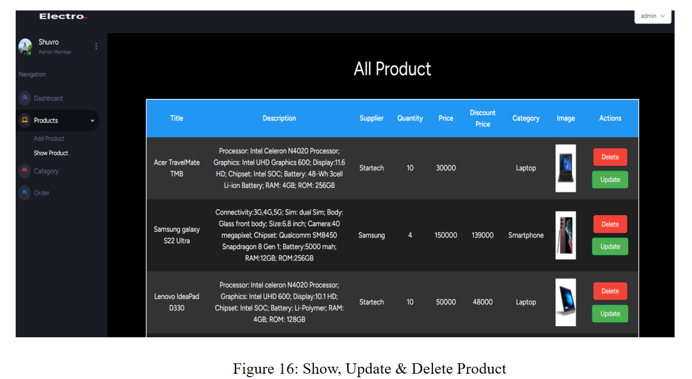

  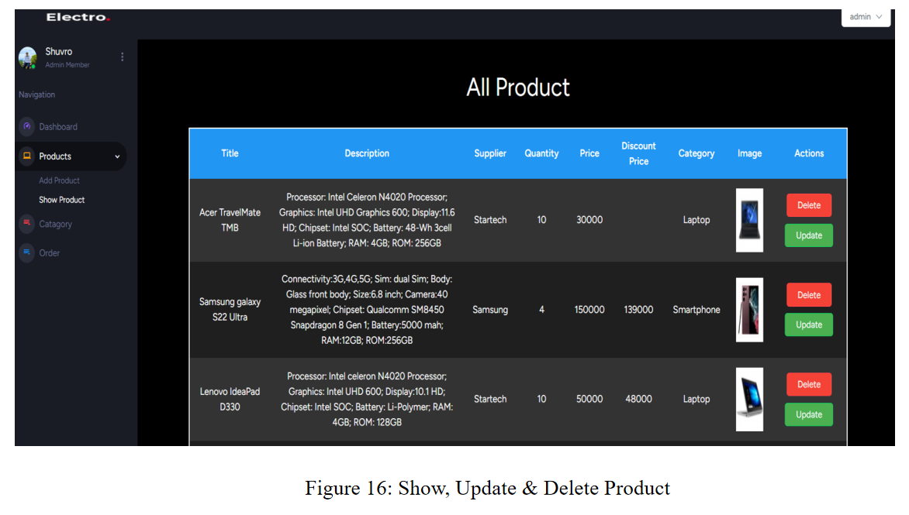

  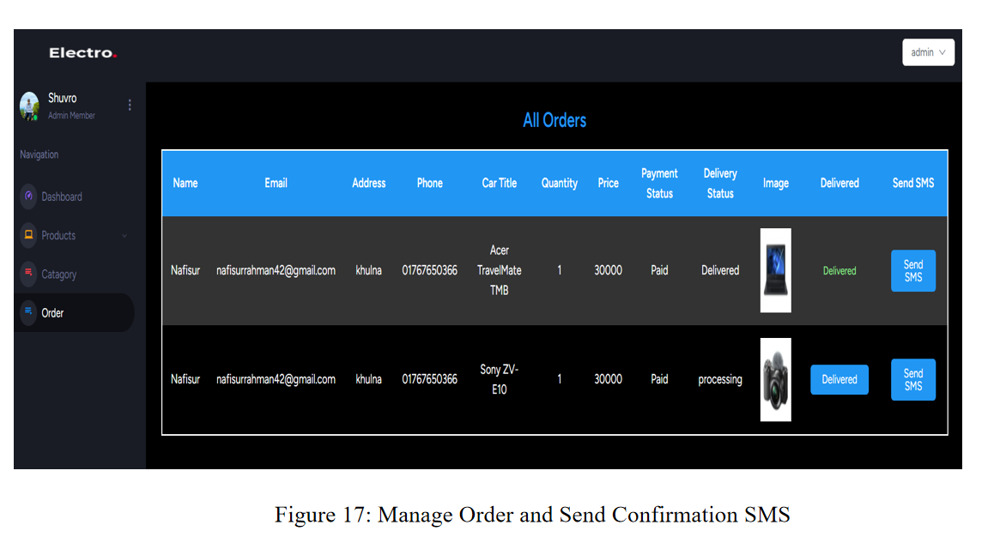

